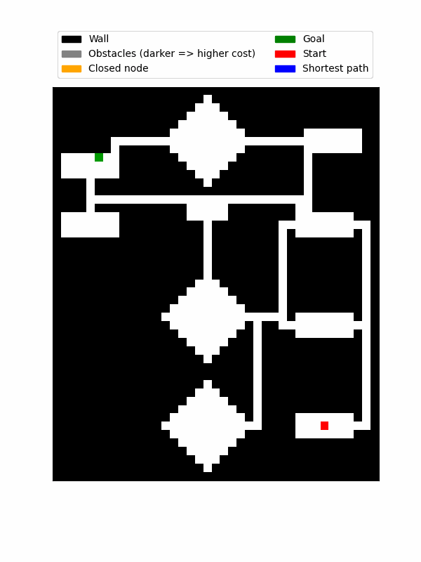

# Assignment 2

An implementation of A* returning the shortest path between two points on a 2D array.

## Task 1:
The task was to find the shortest path between 'Rundhallen' and 'Strossa' using the A* implementation.

## Task 2:
This task is similar to task 1, but from 'Strossa' to 'Selskaps-siden'.

## Task 3:
Task 3 indtroduced different costs for movement, here, the cost is represented by the different shades of gray. The task was to move from 'Lyche' to 'Klubben' using the shortest path (lowest cost).

## Task 4:
Task 4 is similar to task 3, but here 'Edgar' has a really high cost. The path therefore goes around through Rundhallen instead.

